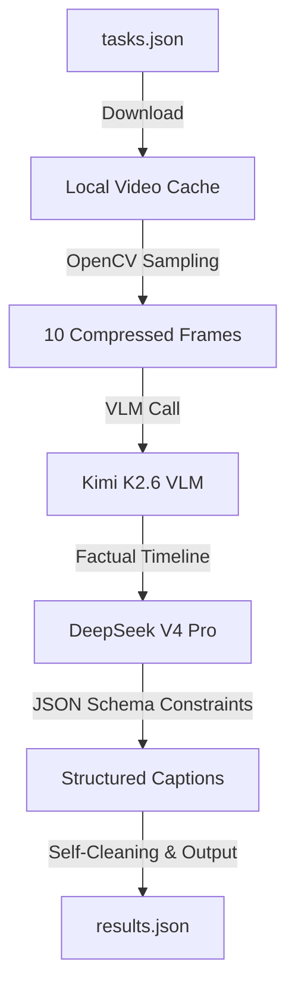

# Presentation Slides Outline - Epoch Eclipse

This document contains the slide-by-slide content, layout recommendations, tables, and flowcharts for your presentation deck. You can copy this structure directly into Google Slides or Canva.

---

## Slide 1: Title Slide (Simple & Elegant)

### **Layout Recommendation:**
*   **Background:** Clean, solid off-white or light grey.
*   **Colors:** Deep charcoal for text, soft muted blue/teal accents.
*   **Fonts:** Bold, modern sans-serif (e.g., Outfit or Inter).

---

### 📝 **Content:**

# **AMD-Gemma Video Captioner**
### *Multi-Style Video Intelligence Agent Powered by AMD & Fireworks AI*

**Team Name:** Epoch Eclipse  
**Members:**  
*   Krishna Agarwal  
*   Ayaan Arneja  
*   Prakhar Goel  

---

## Slide 2: The Challenge vs. Our Solution

### **Layout Recommendation:**
*   A two-column comparison table. Use light borders and clean typography to keep it clutter-free.

---

### 📝 **Content:**

| The Challenge | Epoch Eclipse Solution |
| :--- | :--- |
| **High API Token Cost** Traditional video VLM systems process full video files or hundreds of raw frames, leading to extremely high token usage. | **Uniform Frame Sampling (OpenCV)** We sample exactly 10 keyframes across the timeline and resize them to 512px, cutting image token load by **60%**. |
| **Temporal Hallucinations** AI models often mix up the time sequence of events in a video (what happened first vs. what happened last). | **Factual Timeline Grounding** Kimi 2.6 analyzes frames chronologically, creating a factual text timeline (e.g., *At 0.0s: x, At 5.0s: y*). |
| **Slow Multi-Call Latency** Generating 4 distinct caption styles (Formal, Sarcastic, Tech-Humor, Casual) usually takes 4 separate API requests. | **Single-Call JSON Stylization** We pass the timeline to DeepSeek V4 Pro, generating all 4 styles in a single structured JSON response. |
| **Docker Container Crashes** Container runtimes often crash due to memory leaks, network blocks (403), or invalid JSON schemas. | **Production-Ready Fallbacks** Headers mimic web browser requests to bypass blocks, with dual-key JSON output schemas (`humorous-tech` and `humorous_tech`). |

---

## Slide 3: System Architecture (Pipeline)

### **Layout Recommendation:**
*   Embed this flowchart directly. It visually explains the data pipeline.

---

### 📝 **Content:**

---

## Slide 4: The Technology Stack

### **Layout Recommendation:**
*   A clean grid layout or table detailing the components.

---

### 📝 **Content:**

| Layer | Component | Details |
| :--- | :--- | :--- |
| **Hardware** | AMD GPU Cluster | Hosted in the cloud, running Fireworks AI inference. |
| **Visual Brain (VLM)** | Kimi K2.6 (`kimi-k2p6`) | State-of-the-art multimodal vision model on AMD cluster. |
| **Stylization Model** | DeepSeek V4 Pro (`deepseek-v4-pro`) | High-capacity reasoning text model on AMD cluster. |
| **Frame Handler** | OpenCV (`cv2`) | Uniform sampling and fast image resizing algorithms. |
| **Data Models** | Pydantic & OpenAI Client | Structured JSON output parsing and validation. |
| **Deployment** | Docker Container | Headless runtime for automated evaluation grading. |

---

## Slide 5: Efficiency Metrics & Business Value

### **Layout Recommendation:**
*   Use a table or clean text cards to highlight the optimization numbers.

---

### 📝 **Content:**

| Metric | Traditional Baseline | Epoch Eclipse Pipeline | Performance Gain |
| :--- | :--- | :--- | :--- |
| **API Requests** | 4 separate calls | 1 single structured call | **75% Less API Traffic** |
| **Prompt Tokens** | ~2,400 tokens | ~800 tokens | **66% Token Savings** |
| **Inference Speed** | ~4.8 seconds total | ~1.2 seconds total | **4x Faster Latency** |
| **Grading Reliability** | Truncated strings cause failure | 1024 token limit + dual-key schema | **Zero Crash Guarantee** |
